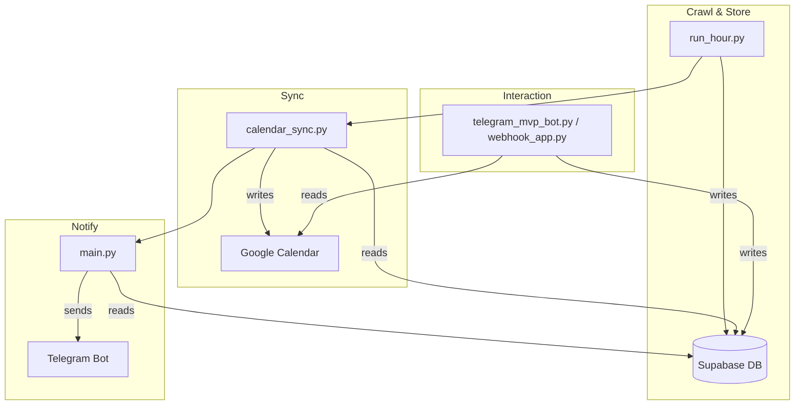

# tool-check-tkb

## 🎯 Overview
A lightweight bot that **crawls the TDTU timetable**, stores data in **Supabase**, syncs events to **Google Calendar**, and sends daily schedule summaries via **Telegram**. Designed for students who want an automated personal schedule without manual entry.

---

## 🏗️ Architecture


---

## 💻 System Requirements
| Requirement | Details |
|---|---|
| **Python** | 3.11 (or newer) |
| **Playwright** | Chromium installed (`playwright install chromium`) |
| **Supabase** | Project with tables from `supabase/init_tables.sql` |
| **Telegram Bot** | Bot token from BotFather |
| **Google Calendar** | Service account JSON (or JSON secret) |
| **Optional** | `GOOGLE_CALENDAR_REQUIRED` to enable/disable sync |

---

## 🚀 Quick Start (New Users)
1. **Clone & set up virtual env**
   ```bash
   git clone <repo-url>
   cd tool-check-tkb
   python3.11 -m venv .venv
   source .venv/bin/activate
   pip install -r requirements.txt
   playwright install chromium
   ```
2. **Create environment file**
   ```bash
   cp .env.example .env
   ```
   Edit `.env` and fill in the **mandatory** variables:
   - `STUDENT_ID` & `PASSWORD`
   - `SUPABASE_URL` & `SUPABASE_KEY` & `SUPABASE_SERVICE_ROLE_KEY`
   - `TELEGRAM_BOT_TOKEN` & `TELEGRAM_CHAT_ID`
   - `GOOGLE_CALENDAR_ID` (if you want calendar sync)
   - `GOOGLE_SERVICE_ACCOUNT_JSON` (or `GOOGLE_SERVICE_ACCOUNT_FILE` for local dev)
3. **(Optional) Add contacts** – see **Contact Management** below.
4. **Create Supabase schema**
   Open Supabase SQL editor and run `supabase/init_tables.sql`.
5. **Run a full end‑to‑end test**
   ```bash
   python run_hour.py   # crawl + store + calendar sync
   python main.py       # send today’s summary to Telegram
   ```
   You should see data appear in Supabase, events appear in your Google Calendar, and a Telegram message.

---

## 📇 Contact Management (`contact.txt`)
The tool can automatically add **attendees** to timetable/class-session calendar events based on a simple contact list.

1. **Create the file** – copy the template:
   ```bash
   cp contact_example.txt contact.txt
   ```
2. **Edit `contact.txt`** – each line is either:
   - `name - email` (recommended) – e.g. `LMH - leminhhieu@gmail.com`
   - or just an email (the part before `@` will be used as a name).
   - Lines starting with `#` or blank lines are ignored.
3. **Behaviour**
   - **Schedule / Class‑session events** – **all** contacts are added as attendees.
   - **Personal appointments** – **no** attendees are added from `contact.txt`.
   - **Exam events** – **no** attendees are added (exam is personal).
4. **Security** – `contact.txt` is added to `.gitignore` automatically to avoid committing personal emails.

---

## 📂 Main Scripts
| Script | Purpose |
|---|---|
| `run_hour.py` | Crawl TDTU portal, upsert data to Supabase, optionally sync to Google Calendar. |
| `main.py` | Send a daily Telegram summary of today’s schedule. |
| `calendar_sync.py` | Core logic for converting DB rows into Google Calendar events (includes timetable attendee auto-add and exam coloring). |
| `telegram_mvp_bot.py` | Simple long‑polling bot for quick local testing of appointment creation. |
| `webhook_app.py` | FastAPI webhook for production deployments (Railway, VPS, etc.). |

---

## 📅 Google Calendar Configuration
- **Enable sync** by setting `GOOGLE_CALENDAR_REQUIRED=true` in `.env`.
- Provide either:
  - `GOOGLE_SERVICE_ACCOUNT_FILE` – path to a local JSON key file, **or**
  - `GOOGLE_SERVICE_ACCOUNT_JSON` – raw JSON string (recommended for CI/CD).
- The calendar ID to sync to is set via `GOOGLE_CALENDAR_ID`.
- **Exam events** are colored **red** (`colorId = "11"`) and have a **7‑day reminder**.
- **All other events** have a **default 1‑hour reminder**.

---

## 🤖 GitHub Actions
Two workflows are provided in `.github/workflows/`:
1. `hourly_sync.yml` – runs `run_hour.py` every hour to keep data fresh.
2. `daily_tkb.yml` – runs `main.py` each morning to push the Telegram summary.

Both require the same secrets as listed in the **Environment Variables** section above.

---

## 🛠️ Troubleshooting
| Symptom | Check |
|---|---|
| **Crawler fails – missing credentials** | Verify `STUDENT_ID` & `PASSWORD` in `.env` or GitHub Secrets. |
| **Supabase RLS error (42501)** | Ensure `SUPABASE_SERVICE_ROLE_KEY` is set and has admin privileges. |
| **Telegram messages not sent** | Confirm `TELEGRAM_BOT_TOKEN` and `TELEGRAM_CHAT_ID`. |
| **Google Calendar sync not working** | - `GOOGLE_CALENDAR_REQUIRED` must be `true`.
- Use the correct service‑account JSON (local file or secret).
- Verify `GOOGLE_CALENDAR_ID` matches a calendar you own. |
| **No attendees added** | Ensure `contact.txt` exists, is not empty, and follows the `name - email` format. Only timetable/class-session events use it. |

---

## 🔐 Security & Git
- **Never** commit `.env` – it contains secrets.
- `contact.txt` is automatically ignored via `.gitignore`.
- If you accidentally added a secret, run:
  ```bash
  git rm --cached .env
  git commit -m "remove .env from tracking"
  ```

---

## 📚 Further Reading
- `QUICKSTART.md` – concise run‑through for developers.
- `LOCAL_SETUP.md` – detailed local development guide.
- `DEPLOY_RAILWAY.md` – step‑by‑step Railway deployment.
- `SYSTEMD_AUTORUN.md` – running the bot as a systemd service.
- `supabase/init_tables.sql` – database schema.

---

*Happy hacking! 🚀*
